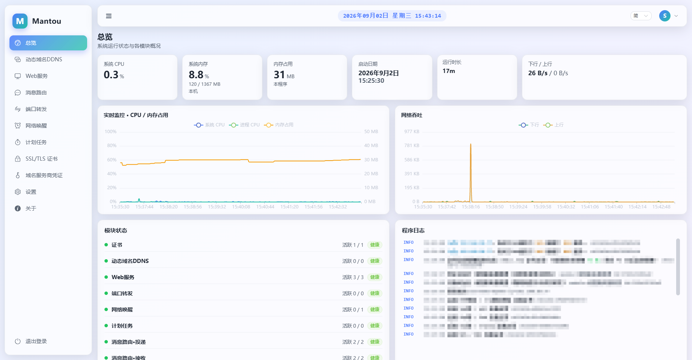

# mantou

English · [简体中文](./README.md)

**mantou** is a networking panel you host and manage yourself. It isn't picky about hardware and doesn't depend on any particular router OS — install it on your own machine and it just runs. Open a browser and you get a bilingual (Chinese & English) admin panel whose look you can adjust freely, with a handful of everyday networking jobs gathered in one place: keeping a domain name pointed at your home broadband address as it changes, sending outside visitors to a service on your home network, port forwarding, powering machines on remotely, running things on a schedule, requesting and renewing HTTPS certificates, and receiving messages pushed in by other systems and passing them on to a channel of your own.

> What you get is **one executable file**: the web interface is already packed inside it, so there's no separate database or middleware to install. Docker works too.



## Features

- **Overview** — see this machine's processor / memory / disk usage at a glance, plus upload and download speed with trend charts, and basic system info.
- **Dynamic DNS** — your home broadband's public address changes. This checks the current address on a timer and, the moment it changes, updates the record at your domain provider automatically, so the domain keeps pointing to the right place.
- **Web Service** — send visits to a domain name over to some service on your home network (a reverse proxy), or just host a static web page directly; HTTPS can be handled at this layer too.
- **Port Forwarding** — pass traffic arriving on one port of this machine straight through to a port on another machine, over TCP or UDP, including between IPv6 and IPv4.
- **Wake-on-LAN** — send a power-on signal to a machine that's switched off on your local network, either by hand or on a schedule.
- **Scheduled Tasks** — do something automatically at a set time: refresh dynamic DNS, wake a device, renew a certificate, or fire off an HTTP request.
- **Certificates** — request and renew HTTPS certificates automatically (via **domain-based verification**, wildcard certificates supported).
- **Message Routing** — give an outside system an address to push to; when a message arrives, your rules pick out the fields, fill in a template, decide whether to send it at all, and pass it on to a channel of your own.
- **Credentials** — keep your domain provider account keys in one place, shared by the dynamic DNS and certificate modules, so you don't have to type them into every rule.
- **Settings** — account, appearance, logging, backup & restore, online updates, and so on.

The interface is **designed from scratch**: colors, background image, blur, corner rounding and font size can all be adjusted in Settings, changes show up immediately, both light and dark themes are there, and once you like the look you can export it to a file and import it on another machine. You have to sign in to get in.

## Tech stack

- Backend: Go (Gin, gopsutil, `golang.org/x/crypto/acme`, robfig/cron)
- Frontend: Vue 3 + Vite + TypeScript + Element Plus + ECharts + vue-i18n
- Deployment: one executable file with the interface packed inside; a Docker image is provided too (amd64 and arm64)

## Quick start

```bash
# Docker (compose)
docker compose up -d

# Docker (manual)
docker run -d --name mantou \
  -p 25666:25666 \
  -v $(pwd)/data:/data \
  --restart unless-stopped \
  mantou:latest

# From source
make build && ./bin/mantou --data ./data
```

Open `http://<host>:25666`. On first visit the panel launches a setup wizard to create the admin account. The panel port lives in `config.json` (edit under Settings → General, restart to apply).

## Running a downloaded build (per platform / architecture)

Grab the archive for your platform from the Releases page (section 7 below has the table mapping file names to platforms). Not sure which one? Check your machine's architecture first:

```bash
uname -m     # Linux / macOS: x86_64 → pick amd64, aarch64 or arm64 → pick arm64
```

On Windows, look at "System type" under Settings → System → About; "x64" means amd64.

Two flags are available: `--data` sets the data directory (defaults to `data/` in the current directory; the `MANTOU_DATA_DIR` environment variable works too), and `--version` prints the version and exits.

### Linux (amd64 / arm64)

```bash
tar -xzf mantou-linux-amd64.tar.gz     # on ARM machines use mantou-linux-arm64.tar.gz
chmod +x mantou
./mantou --data ./data
```

Besides `mantou`, the archive also contains `mantou.sig` when a signing key was configured. That file is only used to verify online updates — it doesn't affect running the binary directly.

To start on boot and stay running in the background, use systemd:

```bash
sudo mv mantou /usr/local/bin/
sudo tee /etc/systemd/system/mantou.service >/dev/null <<'EOF'
[Unit]
Description=mantou
After=network-online.target

[Service]
ExecStart=/usr/local/bin/mantou --data /var/lib/mantou
Restart=always
RestartSec=3

[Install]
WantedBy=multi-user.target
EOF
sudo systemctl enable --now mantou
```

### macOS (arm64 = Apple Silicon / amd64 = Intel)

```bash
tar -xzf mantou-darwin-arm64.tar.gz    # on Intel machines use mantou-darwin-amd64.tar.gz
chmod +x mantou
xattr -d com.apple.quarantine mantou   # clear the "downloaded from the internet" flag
./mantou --data ./data
```

Don't skip the third step: executables downloaded through a browser carry the quarantine attribute, and running one directly is blocked with a "cannot verify the developer" message.

### Windows amd64 (x64)

Unpack `mantou-windows-amd64.zip` to get `mantou.exe` and double-click it; it creates `data\` next to itself. To point it at another data directory, run it from a command prompt:

```
mantou.exe --data D:\mantou\data
```

The Windows firewall prompts on first run — allow it, otherwise other devices on the LAN can't reach the panel.

### Docker (multi-arch — the same command on both architectures)

The image is published as a multi-arch manifest, so `docker pull` automatically fetches the variant matching your machine — **amd64 and arm64 use exactly the same command, no extra flags needed**:

```bash
docker pull ghcr.io/ovoene/mantou:latest

docker run -d --name mantou \
  -p 25666:25666 \
  -v $(pwd)/data:/data \
  --restart unless-stopped \
  ghcr.io/ovoene/mantou:latest
```

There's only one case where you need to be explicit: pulling the arm64 variant on an amd64 machine (or vice versa) for cross-checking.

```bash
docker pull --platform linux/arm64 ghcr.io/ovoene/mantou:latest
```

To confirm which variant you actually got, and which architectures the manifest carries:

```bash
docker image inspect ghcr.io/ovoene/mantou:latest --format '{{.Os}}/{{.Architecture}}'
docker manifest inspect ghcr.io/ovoene/mantou:latest
```

> Packages on ghcr.io are private by default, so pulling requires `docker login ghcr.io` first — or the repo owner setting the package visibility to Public under Settings → Packages.
>
> Wake-on-LAN doesn't work on Docker's default network; see "Notes & known limitations" at the end for why.

## Build, package & release

This section covers the full pipeline: building from source, packaging locally, and pushing to GitHub to auto-produce multi-platform binaries and Docker images.

### 1. Prerequisites (what to install)

| Dependency | Version | Purpose |
|------------|---------|---------|
| Go | ≥ 1.25 (go.mod floor; 1.26 recommended) | Compile the backend binary |
| Node.js + npm | ≥ 20 (22 LTS recommended) | Build the frontend `web/dist` |
| make + tar | Linux / macOS | Makefile packaging script |
| Docker (optional) | 20.10+ | Build images / run containers |
| git | any | Publish to GitHub |

Per-platform install:

- **Linux** (Debian/Ubuntu): `sudo apt install golang-go nodejs npm make`; install Docker via the official script or your distro's repository.
- **macOS**: `brew install go node` (`make` ships with the Xcode Command Line Tools); Docker via Docker Desktop.
- **Windows 10**: install [Go](https://go.dev/dl/), [Node.js](https://nodejs.org/) (bundles npm), and [Git for Windows](https://git-scm.com/) (bundles bash and tar). Windows 10 ships `tar` (bsdtar) out of the box. Use `package.bat` for packaging (equivalent to `make package`); Docker Desktop is optional.

> The repo is a Go-backend + Vue-frontend monorepo; the final artifact is a **single static binary** with the frontend embedded. `node_modules` is build-time only and never shipped.

### 2. Generate the signing key pair & configure the public key (self-update signing)

mantou's self-update packages are signed with **Ed25519** to prevent tampering. The first packaging run generates the key pair automatically; you can also do it manually:

```bash
# Generate manually (or run `make package` / `package.bat`, which auto-generates)
go run ./cmd/updsign gen
# Output: private key saved to update-signing.key; the public key (base64) is printed
```

Configure the printed **public key (base64)** in the mantou panel:

```
Settings → Online update → Self-update signature public key
```

- **Keep the private key `update-signing.key` secret** — never commit or share it (already gitignored). It is a hex string of a 32-byte seed.
- As long as the public key does not change (i.e. you don't delete `update-signing.key` and regenerate), already-configured mantou instances will keep verifying the packages you sign.
- To rotate the key: delete `update-signing.key`, regenerate, and update the new public key in the panel.

### 3. Build & package with the Makefile (Linux / macOS)

```bash
make build                          # build the native binary to bin/mantou (frontend first)
make run                            # build and run (data dir ./data)
make dev                            # frontend dev server with hot reload
make package                        # one-shot: frontend + cross-compile linux/amd64+arm64 + sign + tar.gz
make package PKG_GOARCH=arm64       # build a single architecture
make docker                         # build the Docker image (native arch)
make tidy                           # complete go.sum
make check                          # pre-commit gate: gofmt + go vet + go build + go test (same as CI)
make clean                          # remove build artifacts
```

> `make check` mirrors the Go job in [`.github/workflows/ci.yml`](./.github/workflows/ci.yml) step for step — run it locally before pushing and you won't burn a CI round on a forgotten `gofmt -w`. Note that `gofmt -l` **still exits 0** when it finds unformatted files, so the gate explicitly checks for non-empty output and then `exit 1`; this is an easy trap when writing your own check script.

`make package` outputs (consumable directly by the panel's "Settings/About → Upload update package"):

```
mantou-Ver 1.0.0-linux-amd64.tar.gz   # contains mantou + mantou.sig
mantou-Ver 1.0.0-linux-arm64.tar.gz
```

> Version / build time are injected at build time; the first run generates the signing key and prompts you to configure the public key.

### 4. Package with package.bat (Windows)

Open CMD or PowerShell in the project root:

```bat
package.bat            :: build linux/amd64 + linux/arm64
package.bat arm64      :: build only the given arch(es), e.g. "amd64" or "arm64"
```

Output matches `make package` (the Windows script replaces the space in the version with an underscore, e.g. `mantou-Ver_1.0.0-linux-amd64.tar.gz`). The first run also generates the key pair and prints the public key.

Prerequisites: `go`, `npm`, and `tar` (built into Win10+) must be on PATH; the script defaults to the China Go module proxy `goproxy.cn`.

### 5. Build with Docker

```bash
# Option 1: make wrapper
make docker

# Option 2: docker build directly (inject version and registry mirrors)
docker build \
  --build-arg VERSION="Ver 1.0.0" \
  --build-arg MIRROR=docker.1ms.run/library/ \
  --build-arg GOPROXY=https://goproxy.cn,direct \
  --build-arg NPM_REGISTRY=https://registry.npmmirror.com \
  -t mantou:latest .

# Option 3: compose
docker compose up -d --build
```

Multi-stage build: `node:22-alpine` (frontend) → `golang:1.26-alpine` (backend) → `alpine:3.24` (runtime), final image ~18–25 MB. If pulling base images stalls on restricted networks, switch mirrors via the `MIRROR` prefix.

### 6. Cross-compile binaries for different platforms

| Target | GOOS / GOARCH | Artifact |
|--------|---------------|----------|
| Linux amd64 (x86_64) | `linux/amd64` | `mantou-linux-amd64` |
| Linux arm64 (aarch64 — Raspberry Pi / ARM servers) | `linux/arm64` | `mantou-linux-arm64` |
| macOS amd64 (Intel) | `darwin/amd64` | `mantou-darwin-amd64` |
| macOS arm64 (Apple Silicon) | `darwin/arm64` | `mantou-darwin-arm64` |
| Windows amd64 (x64 — Windows 10/11) | `windows/amd64` | `mantou-windows-amd64.exe` |

Manual cross-compile example (build the frontend first):

```bash
cd web && npm install && npm run build:only && cd ..
CGO_ENABLED=0 GOOS=windows GOARCH=amd64 go build -trimpath -ldflags "-s -w" -o bin/mantou.exe ./cmd/mantou
```

> This platform matrix is already baked into GitHub Actions (below) — push a tag and all binaries are produced automatically, no per-platform local builds needed.
> Note that the "Output" column lists binary names; what Actions publishes to the Releases page are archives — see the table in section 7 for those file names.

### 7. Publish to GitHub (auto build + auto Docker)

The repo ships [`.github/workflows/release.yml`](./.github/workflows/release.yml): pushing a version tag makes GitHub automatically run "multi-platform binary compile + self-update package signing + multi-arch Docker image + GitHub Release".

**7.1 One-time setup**

```bash
# Initialize and make the first commit in the project root (if not already a git repo)
git init
git add .
git commit -m "init mantou"
```

> Note: `internal/version/gen.go` is generated temporarily by the build scripts (and deleted after). It is already listed in `.gitignore`, so there is nothing to commit.

Then create an empty repository on GitHub (e.g. `yourname/mantou`), link it, and push:

```bash
git remote add origin https://github.com/<your-name>/mantou.git
git branch -M main
git push -u origin main
```

**7.2 Configure Secrets (optional but recommended)**

GitHub repo → **Settings → Secrets and variables → Actions** → **New repository secret** (choose the **Repository secrets** level, **not** the **Environments** section on the left):

| Secret | Required | Description |
|--------|----------|-------------|
| `UPDATE_SIGNING_KEY` | Optional | The self-update signing **private key** — i.e. the contents of `update-signing.key` (64 hex chars). ⚠️ This is the **private key**, NOT the public key; the public key (a base64 string) goes into the panel under Settings → Online update → self-update signature public key |
| `DOCKERHUB_USERNAME` / `DOCKERHUB_TOKEN` | Optional | To also push to Docker Hub (default is ghcr.io only). These two secrets alone aren't enough: follow the "also push to Docker Hub" comment block in `release.yml` — uncomment the login step and add `docker.io/<username>/mantou` to the image tags |

**7.3 Publish a new release**

Use the one-click release script (it commits → tags → pushes and resolves same-name tag conflicts automatically). Pick the command for your environment:

**① Windows Command Prompt (cmd) or PowerShell** — use `release.bat`:

```bat
cd /d F:\your-project\mantou
release.bat 1.2.0
rem or without an argument, to be prompted for the version:
release.bat
```

> Note: do **not** type `bash release.sh` directly in Windows cmd/PowerShell — cmd's `bash` points to WSL and fails with `/bin/bash` not found unless a WSL distro is installed. `release.bat` locates Git Bash automatically and runs `release.sh`, so prefer it.

**② Windows Git Bash / Linux / macOS** — use `release.sh`:

- On Windows, open Git Bash by right-clicking inside the project folder → **Git Bash Here** (or search "Git Bash" in the Start menu).
- Then:

```bash
# In Windows Git Bash the drive path differs, e.g. F:\Google\mantou is /f/Google/mantou
cd /f/Google/mantou
bash release.sh 1.2.0       # specify the version
bash release.sh             # no argument → prompted for the version
# or, after making it executable: chmod +x release.sh && ./release.sh 1.2.0
```

**Version note**: `1.2.0`, `v1.2.0`, or `Ver 1.2.0` are all accepted; the script normalizes them to app version `Ver 1.2.0` and git tag `v1.2.0`.

**What the script does**: validates the version → runs `git init` if needed → configures remote `origin` → detects an existing local or remote tag of the same name (prompts to delete) → syncs the app version into `package.bat` / `Makefile` → commits and pushes the branch and tag.

Option 2: manually (without the script):

```bash
# 1) Commit your changes
git add . && git commit -m "release x.y.z"

# 2) Tag and push (tag format: v1.0.0)
git tag v1.0.0
git push origin v1.0.0
```

After the push, GitHub Actions runs the `build-and-release` workflow. It produces two kinds of artifacts:

**1. GitHub Release assets** — binary archives for 5 platforms (`.tar.gz` for Linux / macOS, `.zip` for Windows):

| File name | Platform | What's inside |
|-----------|----------|---------------|
| `mantou-linux-amd64.tar.gz` | Linux amd64 (x86_64) | `mantou` (+ `mantou.sig`※) |
| `mantou-linux-arm64.tar.gz` | Linux arm64 (aarch64 — Raspberry Pi / ARM servers) | `mantou` (+ `mantou.sig`※) |
| `mantou-darwin-amd64.tar.gz` | macOS amd64 (Intel) | `mantou` |
| `mantou-darwin-arm64.tar.gz` | macOS arm64 (Apple Silicon) | `mantou` |
| `mantou-windows-amd64.zip` | Windows amd64 (x64 — Windows 10/11) | `mantou.exe` |

> ※ The signature file is included in the two Linux archives only when `UPDATE_SIGNING_KEY` is configured on the repo (see section 2 above, "Generate the signing key pair & configure the public key"). Without it you get the bare binary, and such a package is only accepted after "Accept unsigned update packages" is turned on in the panel (see "With no signing public key, update packages are refused by default" below). macOS and Windows builds are not signed.
>
> The Windows download is a zip; unpack it to get `mantou.exe`.

**2. Docker image** — pushed to `ghcr.io/<your-name>/mantou`, multi-arch (`linux/amd64` + `linux/arm64`), with **`latest` as the only tag**; no version-number tags are published.

`latest` is a moving tag that always points at the most recent release. To go back to an older version, download that version's binary from the **Releases** page rather than pulling an older image. To find out which version the `latest` you have actually is, check the panel's About page, or read the image label directly:

```bash
docker image inspect ghcr.io/<your-name>/mantou:latest --format '{{index .Config.Labels "org.opencontainers.image.version"}}'
```

If you trigger the workflow manually from the Actions tab (Run workflow) instead of pushing a tag: the binaries are still compiled, but they stay in that run's Artifacts and no Release is created; the image is still pushed as `latest` (a manual run exists precisely to retry a push that failed).

Watch progress on the repo's **Actions** tab and download binaries from **Releases**; pull the image with:

```bash
docker pull ghcr.io/<your-name>/mantou:latest
```

> ghcr.io is GitHub's built-in container registry — no extra signup needed. To let others pull publicly, set the package visibility to Public under repo Settings → Packages.

## Runtime status

The container only has the default `running` / `stop` states — `healthy` / `unhealthy` never appear. The image ships no health check, and the program exposes **no** liveness endpoint of any kind.

That is deliberate: a sign-in-free liveness endpoint confirms to anyone that "something is running behind this port", and that is exactly the first fact a port scanner is after — there is no reason to hand it over for free.

What remains reachable without signing in is only what the sign-in flow itself cannot do without: the login page's static files, `/api/init/status` (the frontend needs it to decide between the setup wizard and the login form), `/api/init/setup`, and `/api/auth/login`. Everything else sits behind sign-in — including the uploaded background image (`/uploads/`).

To see whether it is running, the container runtime's own process state is enough:

```bash
docker ps
```

> `Up` in the status column means the process is running. To confirm the panel actually works, sign in and look at the overview page — that page exists for exactly this, and it sits behind sign-in.

As for the status label itself: Docker never restarts a container for being `unhealthy`; on some router systems (MikroTik RouterOS, for one) the container feature's auto-restart only watches whether the process exited, and likewise ignores the label. What actually consumes it is startup-order dependencies between containers and a load balancer taking bad instances out of rotation — nothing is consuming it for a single self-hosted panel.

## Resource usage (memory / disk)

The program is just one executable file — no database, no middleware, no dependency on any outside service. So it uses very little, and the amount is **something you can work out**.

### The short answer

**Day to day it's tens of megabytes; what actually pushes memory up is how many connections are running at once, not how many features you turned on.**
Give it **128 MB** and you're fine for almost every case; give it **256 MB** if it has to carry heavy forwarding traffic. Don't squeeze it below 64 MB.

### Memory, in three bands

- **Just started, nothing configured, no traffic**: about **15–25 MB**.
- **Home / small office** (the panel plus a few forwards or sites, light traffic): about **30–80 MB**.
- **Under pressure** (lots of concurrent connections, large transfers): possibly **100–200 MB** or more. Go reclaims memory on its own, so it doesn't just climb and never come back.

### Where those tens of megabytes go

Everything below has a **definite ceiling** and does not grow without bound over time. The setting it corresponds to is in parentheses.

| Item | Ceiling | What it is |
| --- | --- | --- |
| Run history | 1 MB | Recent results of message handling |
| Retained inbound originals | **0–3 MB, default 2** (Message Routing → Module settings → retain originals) | For messages that were refused or discarded, a copy of exactly what the other side sent. It's the only thing you have when asking "why didn't this arrive?" Set it to 0 to keep nothing |
| Send queue awaiting retry | 1 MB | Messages that failed to send and are waiting for another attempt |
| Two logs | about **0.7–0.9 MB** by default, about **3.4–4.7 MB** at maximum (Settings → Log → max log entries, default 1000, range 100–5000) | One switch governs all of it: website access records, the program's own runtime log, and the log file on disk. Changes apply immediately with no restart; turning it down keeps only the most recent entries |
| Runtime counters | 1 MB | Per-module tallies (how many received, how many succeeded) |
| Test-run capture | one per receiving address, body up to 256 KB | For debugging. A test run stops itself after 10 minutes, and a captured sample is kept at most 3 hours, then really deleted |
| Per-source rate-limit counters | about 1.8 MB | Two tables, up to 8192 sources each |

The first three together come to at most **5 MB** (4 MB with factory defaults), and that is a hard ceiling: once either the count or the byte budget is full, the oldest entries are dropped first.

### What pushes memory up is connections

- **Port forwarding**: about **64 KB** of transfer buffer per connection (32 KB each direction, returned to a pool when done). Up to 1024 connections per port, and up to 4096 across all rules. A single saturated port is about 64 MB.
- **Reverse proxy**: by default it **passes data through as it arrives** rather than storing a whole page first, so an in-flight response costs about **32 KB**. Up to 2000 connections per listening port.

So estimate memory from the number of simultaneous connections you actually expect. Dynamic DNS, scheduled tasks and certificates are "do a thing at a set time" work and cost almost nothing at rest.

### Online updates barely touch memory, but do need some temporary disk

The update package is **unpacked and written as it arrives** (the archive is never read into memory as a whole, nor stored on disk as a whole), so memory hardly moves. The temporary disk it needs is about **30 MB**, at worst under **80 MB**: the new program file (~13 MB) + the signature file + a backup of the old program, all cleaned up immediately whether it succeeds or fails.

Note that those temporary files go in **the directory the program itself sits in**, not the data directory — replacing the program requires the old and new files to be on the same disk partition. Windows does not support in-place online updates (the request is simply refused); replace the program file by hand and restart.

### How much memory to allocate

Running it directly or under Docker, **128 MB** covers almost every case; give it **256 MB** of headroom if it has to carry heavy forwarding traffic. Do **not** squeeze it below 64 MB, or a traffic spike may get it killed outright by the system.

The image and `docker-compose.yml` already preset `GOMEMLIMIT=200MiB`. That is a **soft** limit: as usage approaches it, the program collects more eagerly and hands memory back to the system instead of being killed; compose additionally sets a hard 256M limit as a backstop. The benefit of that soft limit is very concrete — after a traffic spike inflates a pile of transfer buffers, usage **shrinks back** instead of sitting near the peak looking like a leak. Override it with `-e GOMEMLIMIT=512MiB` if you want more.

### Disk

- **The program itself**: one executable file of about **13 MB**; the download archive is about **4.7–5.1 MB**.
- **The data directory** (set with `--data`, `/data` by default in a container): the config file + the runtime state file (tens of KB each) + logs (**a single file is capped at 5 MB and no history copies are kept, so the log directory takes at most 5 MB**) + certificates (a few KB to a few MB) + the background images and backup files you upload. Day to day this is usually **under 50 MB**.
- **Docker image**: about **18–25 MB**.
- **Only the build machine needs these**: frontend dependencies (`node_modules`, ~198 MB) plus the Go toolchain. None of it ships with the release; the final executable contains only the compiled interface.

> A real deployment needs one program file (or one image) plus one data directory. Reserving **100 MB of disk** is plenty.

> Files in the data directory that nothing refers to any more (a background image you replaced, leftovers from a deleted certificate, a staging directory left behind by an interrupted import) show up under Settings → Backup & restore → Storage usage, where you can clear them out — no need to go digging through the directory yourself.

### When the disk gets written

There are two files in the data directory with clearly separate jobs, and that's what decides how often the disk is written:

- **The config file** `config.json` — panel settings, each module's rules, account keys. **Written only when you press save**, and written as "temp file first, flush to disk, then swap the whole thing in", so a power cut never leaves a half-written or empty file. Otherwise it doesn't move at all, which means its modification time is exactly "when the configuration was last changed".
- **The runtime state file** `state.json` — the address each rule most recently got, the last result, when it runs next, how far along a certificate request is. The program produces these constantly, which is exactly why they're deliberately kept out of the config file: changes take effect in memory first (what you see in the panel is always current), and disk writes are coalesced every **5 seconds**, so several changes within one round of checks still cost one write. A final write is forced before the program exits normally.
  The cost is that a forced kill loses at most 5 seconds of **displayed state**, which the next round restores by itself — **configuration data is unaffected**.

> For backups use the panel's Settings → Backup & restore → Export configuration (it contains the full account keys, see the next section). If you copy the data directory directly instead, then `config.json` must be copied **together with** `master.key`. `state.json` can be rebuilt at any time and is ignored on import, so another machine's history never travels with a backup.

## How the keys are stored (`master.key`)

The fields in the config file that would be trouble in someone else's hands are **not stored in plaintext**. Each one is encrypted separately and looks like this: `enc:v1:…`.

| Field | What someone could do with it |
| --- | --- |
| Domain provider account keys | Change the DNS records of your whole domain |
| The account key used to request certificates | Request certificates in your name |
| The session signing key | Forge an admin identity |
| Two-factor secret (a reserved field, not yet exposed in the interface) | Compute valid one-time codes |

Everything else (ports, the various rules, appearance settings) is still plaintext, so the config file can be opened and read as before — a wrong port or a duplicated rule is still something you can spot by looking at the file.

**The encryption covers the config file only, not the certificate directory.** An issued certificate and its private key are stored as separate files (`<id>.crt` and `<id>.key`) in plaintext. There's a reason for that: you can open them directly when tracking down a problem, and other software on the machine (nginx, say) can use the two files as they are. But the cost comes with it: **one `.key` file is enough to impersonate that domain** until the certificate expires. So **the certificate directory is exactly as sensitive as the config file**: back up through the panel's export (certificates and keys are both in there), and if you copy the data directory directly, treat it as "this copy contains usable private keys" — keep it out of code repositories, and out of snapshots or images you hand around casually.

- **Where the key file is**: `master.key` in the data directory, generated automatically the first time it's needed, readable only by the current user.
- **If you'd rather it never touched the disk**: set the environment variable `MANTOU_MASTER_KEY`. It takes precedence over the key file, and then `master.key` doesn't exist on disk at all — which suits a container's own secret management, or having systemd pass the key in separately.
- **Why encrypt at all**: file permissions only stop "other unprivileged users on the same machine". In practice the most common way things leak is **the whole file being carried away**: copying the data directory as a backup, mounting the data disk somewhere else to investigate, a host snapshot being passed around, accidentally committing the data directory to a repository. Permissions do nothing in any of those cases.
- **What it does not stop**: if someone gets the config file **and** `master.key` (they sit in the same directory), the encryption buys nothing. What it defends against is the large class of "only the config file got out". For stronger isolation, use that environment variable.

### Backup and moving machines

Two routes, pick one:

1. **Export from the panel (recommended, works straight away elsewhere)**: Settings → Backup & restore → Export configuration. The whole exported file is encrypted, with the key derived from **your login account name plus your login password**. So **importing it on a new machine just works**: appearance, theme, every module's rules and the account keys all come back, and you don't need to bring `master.key` along — the importing side re-encrypts with its own freshly generated key. The trade-off: **if you forget the account name and password used at export time, it cannot be recovered**.
   > Sign in afterwards with **the account name and password from the backup** (the login account is overwritten along with everything else). Import **deliberately keeps the new machine's local** session signing key rather than the one inside the backup — otherwise anyone could make a backup with a known signing key and forge an admin identity right after importing it. So if the backup's account name differs from the current one, your current sign-in is invalidated immediately and you sign in again.
2. **Copying the data directory directly**: `config.json` and `master.key` must be copied **together**. If only the config file is restored, the program **fails at startup and tells you how to handle it** rather than staying quiet about it — otherwise DNS updates and certificate renewals would surface a scattering of "account verification failed" errors one cycle later, which is far harder to track down. On this route the certificate private keys travel along in plaintext, so treat the copy as "this copy contains usable private keys" (see the previous section).

### If `master.key` is lost

Cheapest first:

1. Import that encrypted backup from the panel (the full account keys are inside it) — the preferred route.
2. Find the original `master.key` again (an old copy of the data directory, a disk snapshot, or an image layer may well still have it).
3. Neither: set every value in `config.json` that starts with `enc:v1:` to `""`, start up, and type those few account keys in again in the panel. **Everything else (ports, the Web Service / forwarding / scheduled-task rules, appearance settings) is untouched** — you just re-enter the keys and sign in once more.


## Caveats and known limitations

Everything below is a design trade-off or a limitation of the platform itself, not something you configured wrong. If you hit one of these symptoms, start here.

### Wake-on-LAN doesn't work on Docker's default network

The power-on signal goes out as a **local network broadcast**: the program finds every network card on the machine that can broadcast and sends one on each. But on Docker's default bridge network, the container only sees its own virtual card, so the broadcast bounces around inside that little internal network and **never reaches the LAN where the machine you want to wake actually lives**. The panel will say "sent successfully" — the signal really did go out, just onto the wrong network.

The fix (Linux hosts): let the container use the host's network directly — uncomment the `network_mode: host` line in `docker-compose.yml` and delete the `ports` block. **Docker Desktop on Windows / macOS doesn't support that mode**, so on a desktop system just run the program file on the machine itself (`./bin/mantou --data ./data`), which is the least-effort option anyway.

### The container runs as root

The image doesn't drop privileges, so the process inside runs as root. The reason is that Web Services and port forwarding have to be able to occupy **any** port (including privileged ones like 80 and 443), and Wake-on-LAN needs to broadcast — this is how self-hosted networking tools generally work.

You can drop privileges if you want, at the cost of some capability:

```bash
# Keep only "can occupy privileged ports", run as an ordinary user
docker run -d --name mantou \
  --user 1000:1000 \
  --cap-add NET_BIND_SERVICE \
  -p 25666:25666 -v $(pwd)/data:/data mantou:latest
```

Note: `--user` requires the data directory to be writable by that user (`chown -R 1000:1000 ./data`); Wake-on-LAN is basically unusable as a non-root user on a bridge network; and an online update has to overwrite the program file, which fails as non-root because the directory isn't writable (upgrade by pulling a new image and recreating the container instead).

### Windows can't do in-place online updates

On Windows, uploading an update package is refused outright with a note to replace the file by hand. That's Windows' own rule: a running program file can't be renamed over, so the Linux approach of "unpack, then swap it in one step" simply doesn't hold. On Windows, stop the program, replace `mantou.exe`, and start it again. Linux and macOS are unaffected.

### With no signing public key, update packages are refused by default

Whether an update package can be applied is decided by two things under Settings → Online update. Fill in "self-update signature public key" and every uploaded package must carry a matching `.sig` and pass verification. Leave the key empty and it's the "Accept unsigned update packages" switch that decides — and **that switch is off by default**. So on a fresh install with nothing configured, uploading an update package is refused outright, and the About page keeps a notice up saying exactly that. To update without verification you have to turn that switch on yourself — it isn't on by default because that path can replace your program file outright. See the section above for how to generate the keys and where the public key goes.

> Once that switch is on, a package still has to pass several checks: a size limit, a limit on how many files it contains, no duplicate names, an architecture match against the current machine, and finally a trial run of the new file. But those only stop a *broken* package — they can't stop one that someone deliberately swapped in. That takes the signature.

### Baidu Cloud DNS hasn't been verified against a live account

The signing algorithm follows the official documentation exactly and has unit tests watching it; but the addresses and fields for "add / delete / modify / query a record" were written against the usual conventions and have **not been exercised on a real account**. If you use a Baidu Cloud domain and record updates fail, the problem is almost certainly in those addresses or fields — one file to adjust, with no effect on the signing logic or the other providers (Alibaba Cloud, Tencent Cloud / DNSPod and Cloudflare are all verified). Issues with the actual API responses are welcome.

### The "access log" records visits as events, not every request

The Web Service access log deliberately does **not** record every request; it records a handful of things: connected, disconnected, an error, denied by a rule, a periodic probe. Repeat events from the same source within **10 minutes** are merged into one entry, and there's an overall write rate limit too.

That's on purpose: opening one page can generate dozens of requests (the page plus scripts, styles, images), so recording each one would flush the buffer within seconds — evicting exactly what's useful ("who visited which site when, and were they denied") — and once traffic picks up, the logging itself becomes what slows things down. **So don't read these counts as traffic volume, and don't expect this to replace a proper web server's access log** — if you need a log down to every request, produce it upstream or in the backend application.

### To put a username and password on a site, HTTPS has to be on first

A Web Service (reverse proxy or static page) can add a layer of **username and password**: visitors type them in, and only then get passed through to the backend. It's **off by default**, and it belongs to each individual Web Service entry — the toggle only appears once **HTTPS is enabled** on that entry.

The reason is straightforward: this style of authentication sends the username and password along with **every** request, and it's **effectively plaintext**. Over plain HTTP that means broadcasting the password across the network over and over. So it's tied to HTTPS rather than left to the user's judgement.

Correspondingly, **turning on HTTPS also turns on "force HTTPS" automatically** (plain HTTP visits get redirected), with no separate checkbox — otherwise the HTTP port stays reachable and the password still crosses the network in the clear. The password is stored as an **irreversible hash**, so the original can't be read back out.

### After toggling the panel's HTTPS switch you have to sign in again

The panel stores its sign-in state under two different names depending on how you connect: one for plain connections, another for HTTPS ones (the latter carrying the security prefix browsers insist on).

This isn't fussiness — it works around a browser rule: **a plain connection may not create or overwrite a same-named "secure connections only" record, and can't delete one either**. If both connection types shared one name, then after "turn on panel HTTPS → turn it off again → keep visiting over `http://domain`", the record left over from the HTTPS period would swallow every new same-named one, and over a plain connection the server could neither overwrite nor remove it. The symptom: **correct credentials make the UI flash once and bounce back to the login page, while the log says "login succeeded"** (visiting by IP works fine, because these records are stored per domain and there's no leftover on the IP). With two separate names, that conflict is structurally impossible.

There is exactly one cost: **after toggling the panel's HTTPS switch, your current sign-in doesn't carry over and you have to sign in once more** (a different connection type means a different record). For compatibility with older versions, the old name is still **read** (never written), so upgrading doesn't sign anyone out.
